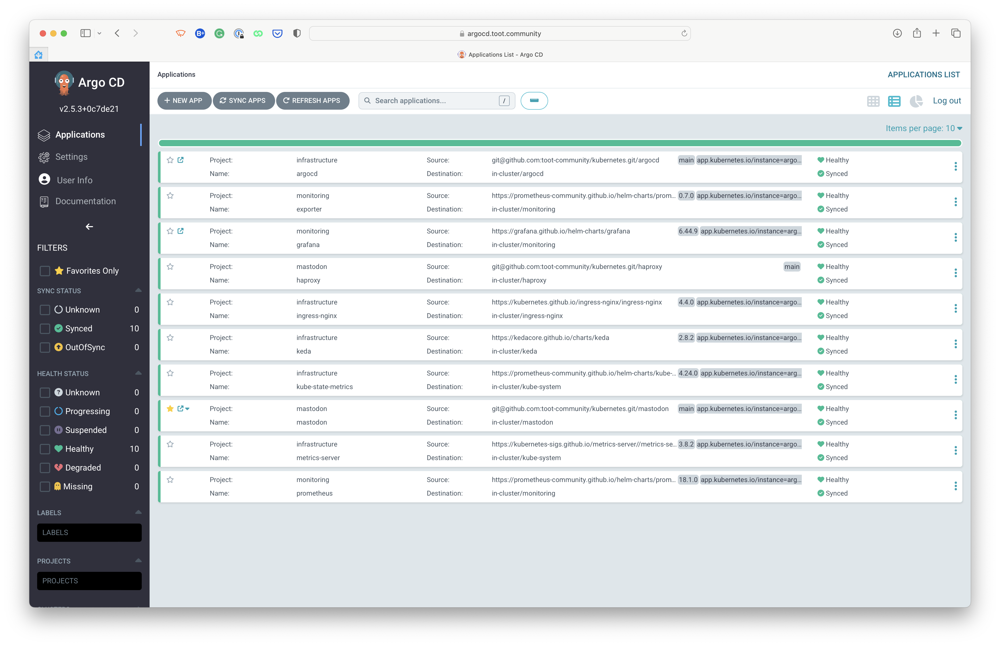
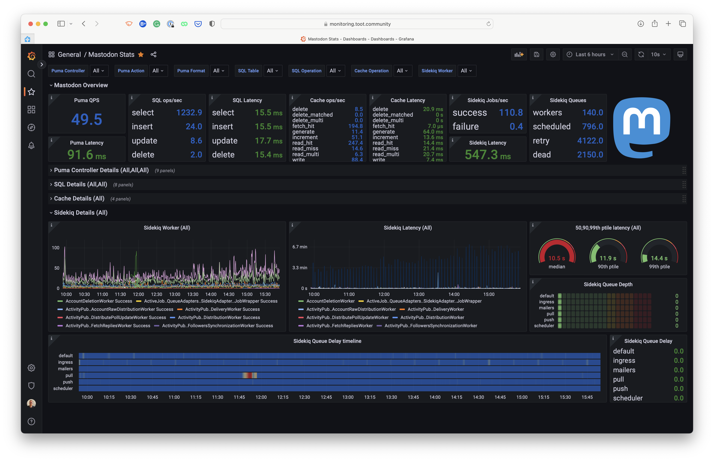
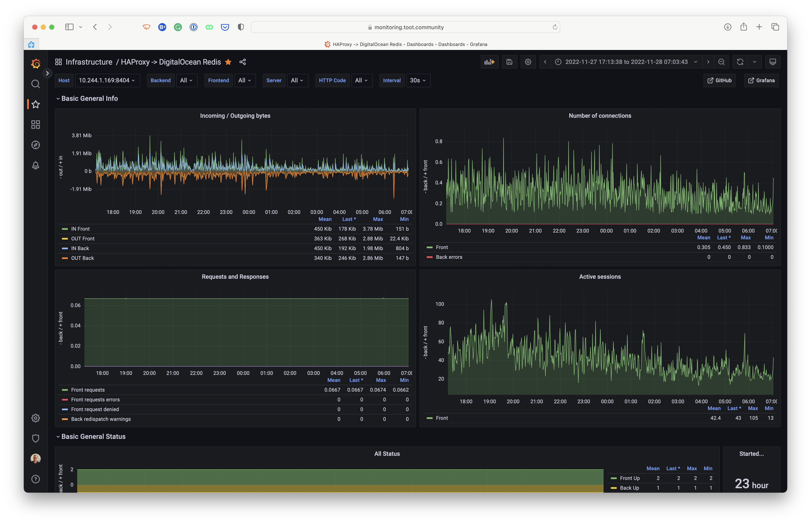
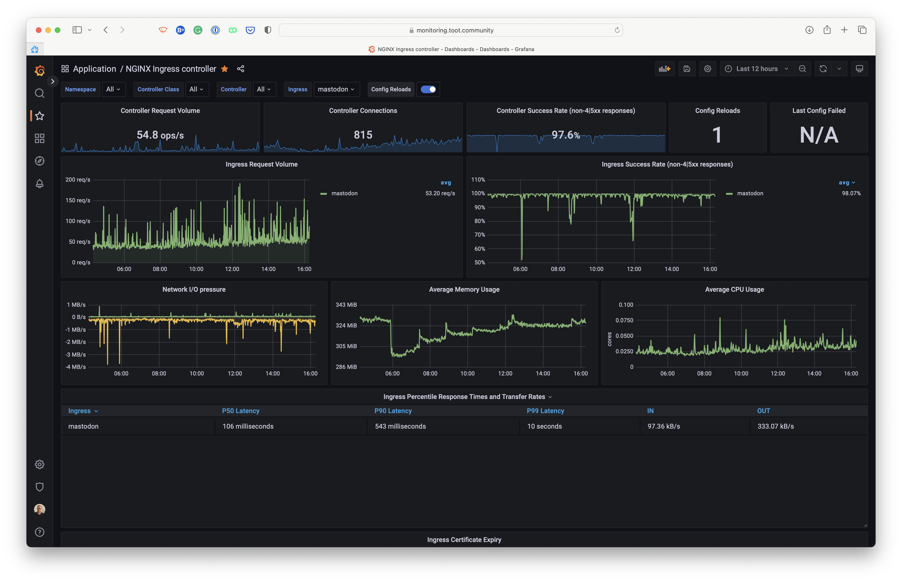

# Kubernetes

> **Warning**:
> This code is provided as-is — it is not meant to be executed verbatim. No support is provided in any way.

This repository contains the code for the components in the Kubernetes cluster
for [toot.community](https://toot.community).

## Introduction

We are providing this code for transparency and to allow others to learn from it; however, it is **not** meant to be
executed verbatim. It is not meant to be a "how to" guide but rather a "what we do" guide. The toot.community cluster
is connected directly to this repository. Any changes to the code in this repository will automatically deploy to
the cluster through ArgoCD.

## Higher overview of components

### ArgoCD

Application definitions, configurations, and environments should be declarative and version controlled. Application
deployment and lifecycle management should be automated, auditable, and easy to understand. Argo CD follows the GitOps
pattern of using Git repositories as the source of truth for defining the desired application state.

ArgoCD manages all the components that are used in our Kubernetes setup through Helm charts, Kustomize or regular
manifests.

#### Directory structure

* `argocd/`: ArgoCD Kustomize base configuration
* `argocd/applications/`: ArgoCD applications definitions
* `argocd/configuration/`: ConfigMap patches for configuring ArgoCD
* `argocd/ingress/`: Ingress definition for ArgoCD
* `argocd/projects/`: ArgoCD projects definitions

### Grafana

Grafana is an open-source, feature rich metrics dashboard and graph editor for Graphite, Elasticsearch, OpenTSDB,
Prometheus.

We use Grafana for charting and visualizing metrics from Prometheus. It allows us to inspect critical metrics from
NGINX, Mastodon, and other parts of our cluster. Since all components are publicly available, we were able to use the
generally available dashboards to consume these metrics.

A unique Mastodon dashboard is made by Pim van Pelt: https://ipng.ch/s/articles/2022/11/27/mastodon-3.html

Other dashboards that we use are:

- https://grafana.com/grafana/dashboards/1860-node-exporter-full/ (Node Exporter)
- https://grafana.com/grafana/dashboards/9614-nginx-ingress-controller/ (NGINX Ingress Controller)
- https://grafana.com/grafana/dashboards/13332-kube-state-metrics-v2/ (Kube State Metrics)
- https://grafana.com/grafana/dashboards/3662-prometheus-2-0-overview/ (Prometheus)
- https://grafana.com/grafana/dashboards/14981-coredns/ (CoreDNS)
- https://grafana.com/grafana/dashboards/14584-argocd/ (ArgoCD)

### HAProxy

HAProxy is a free, high-speed and reliable solution offering high availability, load balancing, and proxying for TCP and
HTTP-based applications.

We use HAProxy as a workaround for the lack of support for Redis TLS in Mastodon. Mastodon and HAProxy are configured in
such a way that Mastodon will connect to HAProxy over a TCP connection and HAProxy will then connect to Redis over TLS.

This component will likely be removed in the future when Mastodon supports TLS for Redis. I'm following this issue on
GitHub: https://github.com/mastodon/mastodon/issues/19824

The application is configured in ArgoCD using plain manifests. Deployment and (application) configuration can be found
in the directory `haproxy/`. It's configured to set up a Service on `do-redis.haproxy.svc.cluster.local` which is used
by Mastodon and spreads the load over all the available HAProxy pods.

### Ingress NGINX

NGINX Ingress Controller is an Ingress controller for Kubernetes using NGINX as a reverse proxy and load balancer.

We use the NGINX Ingress Controller to route traffic to the different services in our cluster.

From an internet-perspective, traffic for toot.community flows as follows:

```
Internet -> Cloudflare -> NGINX Ingress Controller -> Service -> Pods
```

### KEDA

KEDA is a Kubernetes-based event-driven autoscaling component. It allows you to define autoscaling rules for containers.
KEDA can monitor event sources like Kafka, RabbitMQ, or Azure Event Hubs and can trigger a scale-out (and scale-in)
operation.

In our case, KEDA monitors Prometheus and triggers a scale-out when the number of active users on Mastodon is above a
certain threshold. More on that in the chapter of scaling.

### Kube State Metrics

Kube State Metrics is a simple service that listens to the Kubernetes API server and generates metrics about the state
of the objects. DigitalOcean uses it to show detailed graphs about the health of our cluster.

### Metrics Server

Metrics Server is a scalable, efficient source of container resource metrics for Kubernetes built-in autoscaling
pipelines.

### Prometheus

Prometheus is an open-source system monitoring and alerting toolkit originally built at SoundCloud. Since its inception
in 2012, many companies and organizations adopted Prometheus, and the project has a very active developer and user
community.

Prometheus is used to collect metrics from all the components in our cluster. It is configured to scrape metrics from
all Pods containing a specific annotation. In our case, this annotation is `prometheus.io/scrape: "true"`.
Most [CNCF](https://landscape.cncf.io) components are configured to expose metrics in this way.

### Prometheus StatsD Exporter

Prometheus StatsD Exporter is a simple service that listens for StatsD metrics and exports them as Prometheus metrics.

Mastodon can push relevant metrics about its operation to StatsD. Prometheus is configured to scrape metrics from these
Pods. Prometheus StatsD Exporter is used to convert these metrics to Prometheus metrics.

For redundancy, we run two instances of Prometheus StatsD Exporter as containers are temporary, and Mastodon
cannot continue booting if Prometheus StatsD Exporter is unavailable; this is why we run at least two instances of
Prometheus StatsD Exporter.

### LibreTranslate

LibreTranslate is a free and open-source machine translation API used by Mastodon. It's hosted on the cluster as well.
All the configuration for LibreTranslate can be found in the directory `libretranslate/`. It's also deployed through
ArgoCD.

### Mastodon (toot.community)

Mastodon is an accessible, open-source social network server. It is a decentralized alternative to commercial platforms
like Twitter, Facebook, and Instagram. It is based on ActivityPub, an open protocol for decentralized social networking.

Mastodon is the main component of our cluster. It's configured to run on a minimum of two nodes, and it's configured to
scale out when the number of active users is above a certain threshold.

You can find all the manifests for Mastodon in the directory `mastodon/`. It's deploying through ArgoCD.

#### Scaling

Scaling Mastodon is a hot topic; many articles are written on how to tune Puma and the Sidekiq workers. We've configured
our Kubernetes cluster to automatically scale-up/-down worker nodes based on the number of requested CPU cores and
memory. While we monitored usage and adjusted the number of workers, we scale more on the actual use of that time of
day. This means that we only pay for the resources we need at that time of day.

##### Web

The web component of Mastodon is configured to scale out when the number of active users is above a certain threshold.
This is done using Prometheus and KEDA. We aren't measuring _real_ active users but the number of requests per second.
This is done by using the following Prometheus query:

```promql
sum(rate(nginx_ingress_controller_requests{service="mastodon-web"}[1m]))
```

NGINX Ingress Controller software provides this metric, which exposes Prometheus metrics on the `/metrics` endpoint.
This will give us the number of requests per second for the last minute. We are using the last minute to be quick on
scaling out. If we used a more extended period, we would be slower scaling out as the average would be crawling up more
slowly.

We're steering the Horizontal Pod Autoscaler (HPA) to target 25 requests per second per Pod. Measurements have shown
that 25 requests per second consume about one entire CPU core. This means that we can scale out to about 3-4 Pods per
node. Toot.community currently runs on a minimum of 2 nodes, so we have sufficient redundancy. With these two nodes, we
can handle a load of up to about 200 requests per second. There's a margin of about 25-50% before the performance starts
suffering. This margin allows the Kubernetes Cluster Autoscaler to provision and add more nodes while the traffic
increases. Since we can add an unlimited number of worker nodes, we can scale out indefinitely, only limited by the
amount of money we're willing to spend.

If for some reason, Prometheus is unavailable, we assume that the requests per second is 200 and the Pods for handling
web traffic is set to 4.

Strategically, we are only setting the `requests.cpu` and `requests.memory` for the Pods. This ensures there's enough
CPU/memory available for the Pods to run. The `limits.cpu` and `limits.memory` explicitly are not set so that the Pods
can use as much CPU/memory as they want, as long as enough is available. This is done to ensure we can fill out the node
as efficiently as possible.

##### Workers

Scaling the workers is a bit more tricky. We've noticed that Sidekiq workers tend to "steal" CPU cycles from the web
Pods. This means that the web Pods cannot handle the load as efficiently as possible when many jobs are enqueued. To
prevent this, we've configured the workers to be scheduled on a separate, isolated node pool dedicated to Sidekiq, so
the web Pods are not competing for CPU cycles with the workers.

The logic scaling is the same as for the web Pods, with the main difference being that we're not scaling on the number
of requests per second but on the queue latency. The queue latency is the time it takes for a job to be processed. We're
using the following Prometheus query to measure the queue latency:

```promql
sum(mastodon_sidekiq_queue_latency{queue="default"} * scalar(kube_deployment_status_replicas{deployment="mastodon-sidekiq-default"}))
```

This will give us the total queue latency for all the jobs in the `default` queue. We're multiplying this by the number
of active deployments running the `default` queue. The HPA will divide the returned value back by the number of active
Pods back since the configured target metric should be per-Pod.

We're running on a type of water-mark strategy where we increase the number of running workers on a specific queue as
fast and early as possible, but it's slower to scale back down again when the latency is low enough. Our strategy is to
scale out when the queue latency exceeds 5 seconds. Sidekiq traffic tends to be spiky throughout the day so not scaling
back down too down ensures we have plenty of capacity available when the traffic increases again. In practice, it only
scales down on more quiet parts of the day.

### SSL / HTTPS

A typical setup for SSL / HTTPS on Kubernetes is to use a load balancer that terminates the SSL connection and then
routes the traffic to the Pods. In most cases, this is typically done using CertManager with a LetsEncrypt ClusterIssuer
type:

https://cert-manager.io/docs/tutorials/getting-started-with-cert-manager-on-google-kubernetes-engine-using-lets-encrypt-for-ingress-ssl/

However, this is not the ideal situation for us because we use Cloudflare as a CDN and load balancer. Cloudflare is
responsible for provisioning SSL certificates. The connection(s) between Cloudflare and our Kubernetes cluster are
encrypted using a [Origin Certificate](https://developers.cloudflare.com/ssl/origin-configuration/origin-ca/), allowing
a full (strict) type setup.

#### Authenticated Origin Pulls

Authenticated Origin Pulls allows for us cryptographically verify that requests to our origin server come from
Cloudflare using a TLS client certificate. This prevents clients from sending requests directly to our origin, bypassing
security measures provided by Cloudflare, such as IP and Web Application Firewalls, logging, and encryption.

More information about how we configured this can be found in the directory `ingress-nginx/`.

### Secret Management

For our cluster, we use the 1Password Operator to manage secrets. It's connected to a shared 1Password vault, and
whenever we make changes to the secrets in the vault, the operator will update the secrets in the cluster.

Should you choose to fork this repository or use it as a reference, you will need to replace the 1Password Operator with
something of your choosing. You can use plain Kubernetes secrets or a different secret management solution such as
Hashicorp Vault.

## Funding

This project is funded by the users of toot.community. If you want to support this project, please have a look over at:

- Ko-Fi: https://ko-fi.com/jorijn (preferred)
- Patreon: https://patreon.com/tootcommunity

## Screenshots

### ArgoCD



### Grafana




